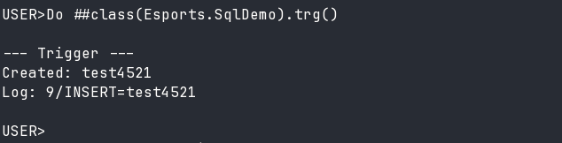

# Лабораторна 6: SQL та тригери

Кіберспортивна ліга

Різні способи виконання SQL-запитів в IRIS та тригер для логування.

## Dynamic SQL

Запит через `%SQL.Statement` з параметром: вибірка топ-5 гравців з рейтингом >= заданого. Використовує implicit join `team->name` для отримання назви команди.

```sql
SELECT TOP 5 nick, rating, team->name FROM Esports.Player
WHERE rating >= ? ORDER BY rating DESC
```

## Embedded SQL

Простий запит — вибірка топ-гравця одним рядком через `&sql(SELECT ... INTO :var)`.

Курсор — покрокова вибірка топ-3 гравців через `DECLARE`, `OPEN`, `FETCH` у циклі, `CLOSE`.

## COS-based Query

Класовий запит `Esports.Tournament:by_dates` з параметрами діапазону дат. Реалізовані методи Execute, Fetch, Close для ітерації по результатах.

## Implicit Join

Оператор `->` для навігації по зв'язках без явного JOIN: `tournament->title`, `team_a->name`, `team_b->name` у запиті матчів.

## Тригер

`log_chg` спрацьовує після INSERT/UPDATE на таблиці Player та записує зміни в глобал `^esports_log("player", id, operation, timestamp)`. Логує нікнейм гравця.



