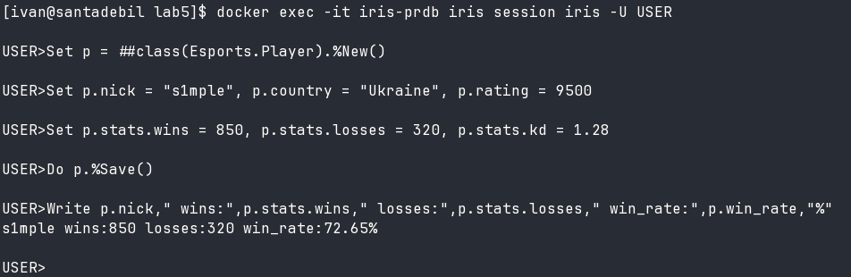
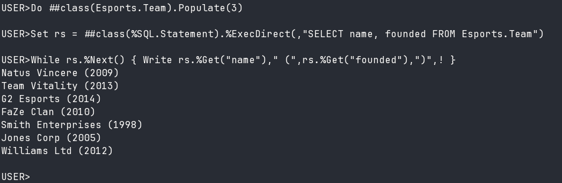
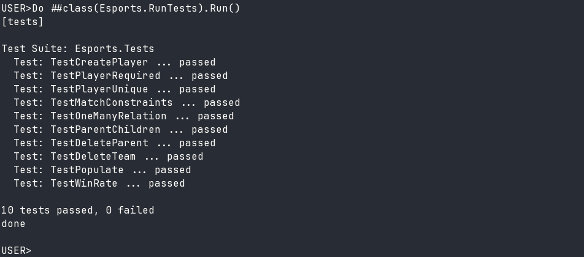

# Лабораторна 5: Методи та тести

Кіберспортивна ліга

Розширення класів методами, обчислюваними властивостями та автогенерацією. Unit-тести для перевірки логіки.

## Обчислювана властивість

`Player.win_rate` розраховується автоматично з `stats.wins` та `stats.losses` через getter-метод `win_rateGet()`. Формула: `wins / (wins + losses) * 100`. Значення не зберігається в БД, а обчислюється при кожному зверненні.

## Автогенерація через %Populate

Класи `Team` та `Player` підтримують `%Populate` для генерації тестових даних. Метод `Populate(N)` створює N випадкових об'єктів з валідними даними. Метод `Player.stats_populate()` заповнює статистику гравця випадковими значеннями.

## Unit-тести

10 тестів у класі `Esports.Tests`:

| Тест | Що перевіряє |
|------|--------------|
| TestCreateTeam | Створення та збереження команди |
| TestTeamRequired | Помилка при відсутньому name |
| TestPlayerUnique | Помилка при дублікаті nick |
| TestPlayerConstraints | Валідація rating (0-10000) |
| TestOneMany | Зв'язок Player→Team |
| TestParentChildren | Зв'язок Tournament→Match |
| TestCascade | Каскадне видалення матчів з турніром |
| TestNoDelWithPlayers | Заборона видалення команди з гравцями |
| TestWinRate | Обчислення win_rate |
| TestPopulate | Робота %Populate |

## Запуск

```objectscript
Do ##class(Esports.RunTests).Run()
```






