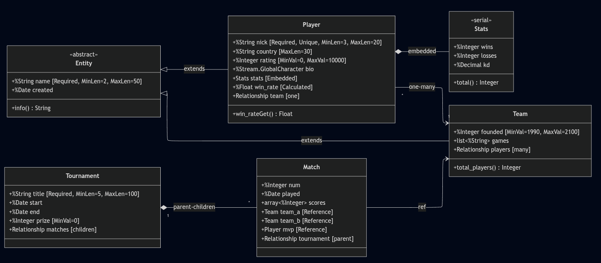

# Лабораторна 3: Діаграма класів

Кіберспортивна ліга

UML-діаграма для подальшої реалізації в IRIS.

## Модель даних

Центральні сутності — гравці та команди. Гравець (`Player`) належить до команди (`Team`) через відношення one-many: команда може мати багато гравців, але гравець прив'язаний до однієї команди.

Турніри (`Tournament`) та матчі (`Match`) пов'язані через parent-children: видалення турніру каскадно видаляє всі його матчі. Матч посилається на дві команди-учасниці та MVP гравця.

Статистика (`Stats`) вбудовується в гравця як serial-об'єкт. Обчислювана властивість `win_rate` в Player розраховується з даних Stats.

## Типи властивостей

Атомарні типи: `%String`, `%Integer`, `%Decimal`, `%Date`. Потік `%Stream.GlobalCharacter` для біографії гравця. Колекції: `list of %String` для ігор команди, `array of %Integer` для рахунків матчу.

Обмеження: Required для обов'язкових полів, Unique для нікнейму гравця, MinVal/MaxVal для числових діапазонів, MinLen/MaxLen для довжини рядків.
